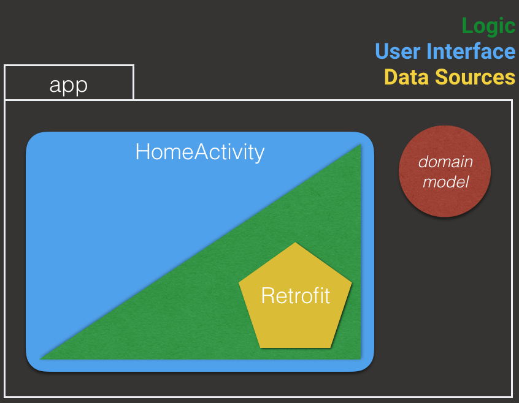

Mono to Clean - Mono
============

This repository contains the source code of the Monolithic app used on my talk "Monolithic to Clean" where I explain how I evolved from a monolithic
architecture to a clean architecture with RxJava based on [Fernando Cejas Proposal][1] 

[1]: http://fernandocejas.com/2015/07/18/architecting-android-the-evolution/
